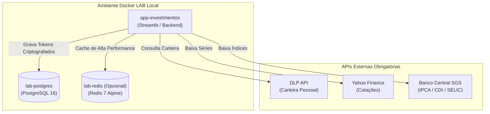

# Mapeamento e Análise de Dependências Externas: `app-investimentos`

> **Data:** 2026-08-27  
> **Objetivo:** Identificar todas as dependências externas (Cloud, APIs, Autenticação, Cache) do projeto na branch `dev` e definir a estratégia de conversão para o ecossistema Docker LAB local.

---

## 1. Matriz de Dependências Externas

| Dependência | Função no Projeto | Situação Atual (`dev`) | Estratégia no Docker LAB |
|---|---|---|---|
| **Supabase** | Armazenamento de tokens DLP dos usuários (`user_tokens`) | Nuvem (REST API / Service Role) | **Migrar 100%** para o PostgreSQL local (`lab-postgres`). |
| **Upstash Redis** | Cache distribuído de cotações B3, Yahoo Finance e BCB | Nuvem (Upstash REST API) | **Suportar Redis local (`lab-redis`)** ou fallback em memória/arquivos CSV. |
| **DLP API** (`dlombelloplanilhas.com`) | Busca das movimentações e carteira do usuário | API Externa HTTP (requer Token DLP) | **Manter** (essencial para sincronizar a carteira do usuário). |
| **Yahoo Finance (`yfinance`)** | Cotações de ações, ETFs e índices globais | API Externa (Yahoo Finance) | **Manter** (com cache local no Redis / SQLite / CSV). |
| **Banco Central (`python-bcb`)** | Séries temporais de IPCA, CDI e SELIC | API Pública (BCB SGS) | **Manter** (com cache local). |
| **Selenium + Chromium** | Web scraping de taxas B3 e Tesouro Direto | Browser Headless local no container | **Manter no Dockerfile** com pacotes ARM64 (`chromium`, `chromium-driver`). |
| **Google OAuth2 (`authlib`)** | Autenticação de usuários | Google Cloud Console OAuth2 | **Modo Dev / Local** como padrão, sem depender do Google OAuth2. |

---

## 2. Detalhamento do Redis (Cache de Mercado)

### Como funciona hoje:
No arquivo [src/data/cache.py](file:///data/projetos/app-investimentos/src/data/cache.py):
1. **Nível 1 (Memória RAM):** Dicionário `_LOCAL_CACHE` em memória com TTL de 60s a 1h.
2. **Nível 2 (Upstash Redis):** Usa a biblioteca `upstash-redis` que faz requisições HTTPS para a URL do Upstash (`UPSTASH_REDIS_REST_URL`).
3. **Nível 3 (Fallback em Disco):** Arquivos CSV estáticos pré-salvos em `data/raw/` e `data/static/`.

### O que faremos no LAB:
- O `upstash-redis` funciona exclusivamente via protocolo HTTP REST do provedor Upstash.
- Para tornar o LAB **100% autossuficiente e offline em relação a provedores pagos**:
  1. Refatorar `src/data/cache.py` para suportar o **Redis Padrão (TCP)** via biblioteca `redis` (`redis-py`), permitindo rodar um container `redis:7-alpine` no Docker LAB.
  2. Caso o Redis não esteja configurado, o app opera perfeitamente apenas com o cache em memória e arquivos locais em `data/raw/`.

---

## 3. Topologia Proposta para o LAB

