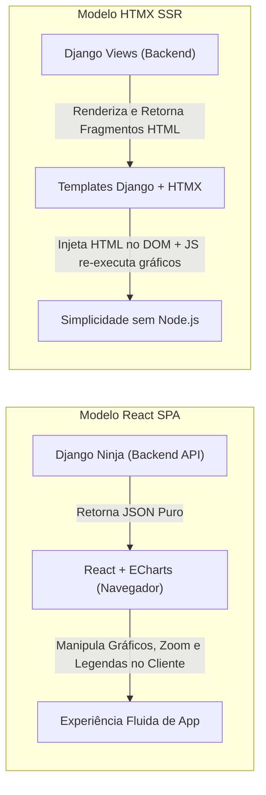

# Comparativo de Frontend: React vs HTMX para o `app-investimentos`

> **Data:** 2026-08-27  
> **Branch de Trabalho:** `lab-dev`  
> **Tema:** Escolha da camada de Frontend (React vs HTMX) integrada ao Backend Django

---

## 1. Visão Geral das Duas Abordagens

O `app-investimentos` é essencialmente um **dashboard analítico-financeiro**: sua complexidade não está em formulários simples de cadastro (CRUD), mas sim em **visualização de dados, manipulação de séries temporais, gráficos interativos com dezenas de benchmarks simultâneos, filtros de período e métricas de risco**.



---

## 2. Quadro Comparativo Direto

| Critério | **React (SPA + Vite + ECharts)** | **HTMX (Django Templates + ECharts)** |
|---|---|---|
| **Especialidade** | Dashboards interativos, visualização de dados, SPAs ricas. | Aplicações orientadas a formulários, tabelas, portais administrativos. |
| **Manipulação de Gráficos** | **Excelente:** O React mantém o estado do gráfico no cliente. O usuário clica na legenda para ligar/desligar ativos, dá zoom e move o cursor sem fazer requisições extras ao servidor. | **Moderada:** O HTMX substitui blocos de HTML. Para atualizar um gráfico, o servidor retorna novo HTML/script e o JS precisa recriar a instância do gráfico Canvas/SVG. |
| **Pilha de Tecnologias** | Python (Django) + JavaScript/TypeScript (Node/npm para build). | **100% Python (Django)** + pequenos scripts JS/Alpine. Sem npm/Node. |
| **Desacoplamento do Backend** | **Total:** O Django serve apenas JSON via API REST (`/api/v1/`). Qualquer cliente (Web, Mobile, CLI) pode consumir a mesma API. | **Parcial:** As views do Django retornam pedaços de HTML renderizados pelo servidor. |
| **Curva de Aprendizado** | Requer conhecimento em componentes React, JSX, hooks (`useState`, `useEffect`). | **Mínima:** Aproveita 100% da sua experiência com Django (templates, tags, filters). O HTMX usa apenas atributos HTML (`hx-get`, `hx-target`). |
| **Ecossistema de Componentes** | Gigantesco: Tailwind UI, Shadcn UI, Radix, Lucide Icons, date-pickers de mercado financeiro. | Limitado ao que você estilizar no HTML ou integrar via Alpine.js. |
| **Deploy / Orquestração** | O Vite compila para arquivos estáticos (`index.html`, `bundle.js`), servidos diretamente pelo container Nginx. | O próprio Django serve as páginas HTML via Gunicorn/Nginx. |

---

## 3. Análise Detalhada: Vantagens e Desvantagens no Nosso Projeto

### 3.1. React (Vite + Tailwind CSS + Apache ECharts)

#### Vantagens:
1. **Perfeito para Dashboards Financeiros:**
   - No `app-investimentos`, o usuário quer selecionar 5 benchmarks (CDI, IBOV, S&P 500, SMLL, IPCA+6%), alterar o período de 5 anos para 1 ano e ver os gráficos recalcularem instantaneamente.
   - O React recebe o array JSON da API Django Ninja e passa diretamente para o **Apache ECharts**. O cliente ganha animações de transição suaves, tooltips sincronizados e controles de zoom interativos (dataZoom slider).
2. **Separação Clara de Responsabilidades:**
   - O Backend Django cuida apenas de matemática financeira (TWR, TIR, Sharpe), banco de dados e cache.
   - O Frontend React cuida apenas da experiência do usuário e renderização visual.
3. **Padrão de Mercado para FinTechs e Análise de Investimentos:**
   - Quase todas as plataformas financeiras modernas (Status Invest, Gorila, TradeMap, Kinvo) utilizam SPAs em React/Vue devido à fluidez gráfica.

#### Desvantagens:
- Requer ambiente Node.js para o processo de build do Vite (embora em produção o build seja gerado em arquivos estáticos servidos pelo Nginx).

---

### 3.2. HTMX (Django Templates + Tailwind CSS + ECharts)

#### Vantagens:
1. **Velocidade de Setup Inicial:**
   - Não precisa configurar `package.json`, `node_modules` ou ferramentas de empacotamento JS.
2. **Reaproveitamento de Conhecimento:**
   - Como você já conhece Django, a criação de telas em HTML é natural e direta.
3. **Excelente para Telas de Gestão e Tabelas:**
   - Para a tabela de rentabilidade ano a ano, tela de configurações de tokens ou filtros simples, o HTMX é muito ágil.

#### Desvantagens no Contexto de Investimentos:
- **Atrito com Gráficos Baseados em Canvas (ECharts):**
  - O ECharts precisa de um elemento DOM persistente e de dados em objetos JavaScript. 
  - Com HTMX, quando uma requisição AJAX substitui a `<div>` do gráfico, o canvas anterior é destruído. É necessário usar "hooks" de JavaScript ou Alpine.js para reinicializar o gráfico a cada troca de filtro, o que pode causar piscadas na tela e código JS misturado aos templates.
- **Acoplamento:**
  - O Django precisa de views específicas que retornam HTML para o HTMX, além das APIs JSON caso queira expor dados para outros fins.

---

## 4. O Veredito: Qual se encaixa melhor no nosso projeto?

### 🏆 Recomendação Técnica: **React (com Vite + Tailwind + Apache ECharts)**

**Por que o React se encaixa melhor:**
1. Nosso objetivo principal é **desacoplar a aplicação** e fornecer **gráficos e comparativos de alta fidelidade visual e interatividade**.
2. A combinação **Django Ninja (Backend API JSON) + React (Frontend SPA)** é a arquitetura ideal:
   - O Django Ninja processa os dados com pandas/numpy e entrega JSON rápido com documentação Swagger em `/api/docs`.
   - O React consome esses JSONs e monta um dashboard moderno, rápido e com gráficos interativos de nível profissional.
3. Como nós estruturaremos e implementaremos os componentes do frontend para você, a barreira do React é totalmente superada, entregando o melhor produto final possível.

---

## 5. Arquitetura de Deploy Unificada no Docker LAB

```
Docker LAB (Ambiente Local):
┌────────────────────────────────────────────────────────┐
│  lab-nginx (:80 / :8080)                                │
│    ├── /api/*    ──► lab-backend (Django Ninja :8000)   │
│    ├── /admin/*  ──► lab-backend (Django Admin :8000)   │
│    └── /*        ──► lab-frontend (React SPA Estático)  │
└────────────────────────────────────────────────────────┘
         │                          │
         ▼                          ▼
┌──────────────────┐       ┌──────────────────┐
│ lab-postgres:5432│       │  lab-redis:6379  │
│ (PostgreSQL 16)  │       │  (Redis 7)       │
└──────────────────┘       └──────────────────┘
```
