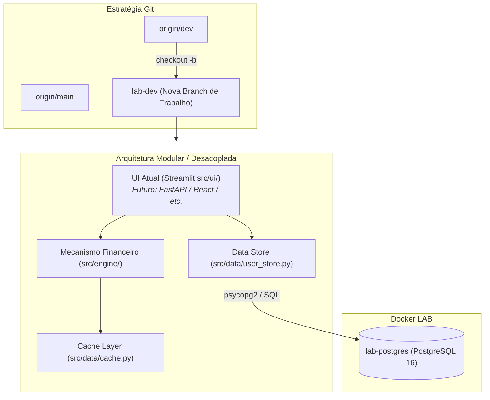

# Plano de Migração: Nova Branch de Trabalho, PostgreSQL Local e Desacoplamento de UI

## Visão Geral e Objetivos

Para manter a branch `dev` íntegra e permitir alterações evolutivas profundas (migração para PostgreSQL local e futura substituição ou evolução da camada de frontend Streamlit para outro modelo/framework como FastAPI + React/Vue, FastHTML, Flet, etc.), criaremos uma **nova branch de desenvolvimento** a partir de `origin/dev`.

### Principais Metas:
1. **Criação da Nova Branch:** Criar e alternar para a branch de trabalho (sugestão: `lab-dev` ou `feat/postgres-refactor`) a partir de `origin/dev`.
2. **Migração e Desacoplamento da Camada de Dados:**
   - Substituir a dependência do Supabase pelo **PostgreSQL local** (`lab-postgres`).
   - Isolar a camada de acesso a dados (`src/data/`) de modo agnóstico à interface gráfica, facilitando a troca futura do Streamlit por APIs REST (FastAPI) ou outro framework de frontend.
3. **Infraestrutura Docker LAB:**
   - Conectar o container do app à rede do `lab-postgres` (`lab-postgres_default`).
   - Configurar variáveis de ambiente e `.env` / `secrets`.
4. **Atualização da Documentação:** Atualizar [/home/ubuntu/LAB/app-investimentos-docker.md](file:///home/ubuntu/LAB/app-investimentos-docker.md).



---

## User Review Required

> [!IMPORTANT]
> **Nome da Nova Branch:**
> Sugerimos nomear a nova branch como `lab-dev` ou `feat/postgres-refactor`. Ela será criada a partir do estado atual da `origin/dev`. A branch `dev` original permanecerá intacta no repositório.

> [!TIP]
> **Desacoplamento do Streamlit na Camada de Dados:**
> Atualmente, `src/data/user_store.py` usava `st.secrets`. Vamos refatorá-lo para ser **100% agnóstico ao framework web**, priorizando variáveis de ambiente / `.env` com fallback para `st.secrets` se executado via Streamlit. Isso permitirá plugar qualquer framework no futuro (FastAPI, CLI, scripts, etc.) sem quebrar a camada de banco.

---

## Open Questions

> [!NOTE]
> 1. **Nome preferido para a branch:** Deseja usar `lab-dev` ou tem outro nome de preferência (ex: `dev-lab`, `feat/postgres-v4`)?
> 2. **Visão para o novo modelo de UI:** Você já tem em mente o modelo/framework substituto do Streamlit (ex: **FastAPI + React/Tailwind**, **FastHTML**, **Flet**, **Django/Flask**)? O plano já deixa a arquitetura preparada para esse desacoplamento.

---

## Proposed Changes

```
/data/projetos/app-investimentos/
├── .env.example                      [NEW] Template de variáveis de ambiente agnóstico
├── .streamlit/
│   └── secrets.toml.example          [MODIFY] Ajustar para banco PostgreSQL local
├── Dockerfile                        [MODIFY] Ponto de entrada modular, suporte ARM64
├── docker-compose.yml                [MODIFY] Conectar à rede do lab-postgres
├── requirements.txt                  [MODIFY] Remover supabase, adicionar psycopg2-binary
└── src/
    └── data/
        ├── schema_postgres.sql       [NEW] Script SQL da tabela user_tokens
        └── user_store.py             [MODIFY] Adaptado para PostgreSQL puro (independente de Streamlit)

/home/ubuntu/LAB/
└── app-investimentos-docker.md       [MODIFY] Guia atualizado com nova branch e banco local
```

---

### Componente 1: Criação da Nova Branch no Git

Comandos a serem executados em `/data/projetos/app-investimentos`:

```bash
cd /data/projetos/app-investimentos
git fetch origin
git checkout -b lab-dev origin/dev
```

---

### Componente 2: Camada de Dados Agnóstica (PostgreSQL)

#### [NEW] [src/data/schema_postgres.sql](file:///data/projetos/app-investimentos/src/data/schema_postgres.sql)
```sql
-- DDL para a tabela de tokens de usuário no PostgreSQL
CREATE TABLE IF NOT EXISTS public.user_tokens (
    user_email VARCHAR(255) PRIMARY KEY,
    encrypted_token TEXT NOT NULL,
    updated_at TIMESTAMP WITH TIME ZONE DEFAULT CURRENT_TIMESTAMP NOT NULL
);
```

#### [MODIFY] [src/data/user_store.py](file:///data/projetos/app-investimentos/src/data/user_store.py)
Acesso agnóstico a banco e segredos:

```python
import os
import psycopg2
from psycopg2.extras import RealDictCursor
from cryptography.fernet import Fernet
from src.utils.logger import logger

def _get_fernet_key() -> str:
    # 1. Variável de ambiente
    key = os.getenv("FERNET_KEY")
    # 2. Fallback para st.secrets se disponível
    if not key:
        try:
            import streamlit as st
            key = st.secrets.get("security", {}).get("fernet_key")
        except Exception:
            pass
    if not key:
        raise ValueError("Chave FERNET_KEY não configurada no ambiente ou secrets.")
    return key

def _get_cipher() -> Fernet:
    key = _get_fernet_key()
    return Fernet(key.encode() if isinstance(key, str) else key)

def _get_db_connection():
    # Suporta variáveis de ambiente padrão ou st.secrets
    host = os.getenv("POSTGRES_HOST")
    port = os.getenv("POSTGRES_PORT", "5432")
    database = os.getenv("POSTGRES_DB", "banco_lab")
    user = os.getenv("POSTGRES_USER", "postgres")
    password = os.getenv("POSTGRES_PASSWORD", "MinhaSenhaForte123!")

    if not host:
        try:
            import streamlit as st
            pg = st.secrets.get("postgres", {})
            host = pg.get("host", "lab-postgres")
            port = pg.get("port", port)
            database = pg.get("database", database)
            user = pg.get("user", user)
            password = pg.get("password", password)
        except Exception:
            host = "lab-postgres"

    return psycopg2.connect(
        host=host,
        port=int(port),
        database=database,
        user=user,
        password=password
    )

def save_dlp_token(user_email: str, raw_token: str):
    cipher = _get_cipher()
    encrypted_token = cipher.encrypt(raw_token.encode()).decode()
    with _get_db_connection() as conn:
        with conn.cursor() as cur:
            cur.execute("""
                INSERT INTO public.user_tokens (user_email, encrypted_token, updated_at)
                VALUES (%s, %s, CURRENT_TIMESTAMP)
                ON CONFLICT (user_email) 
                DO UPDATE SET encrypted_token = EXCLUDED.encrypted_token, updated_at = CURRENT_TIMESTAMP;
            """, (user_email, encrypted_token))
        conn.commit()

def load_dlp_token(user_email: str) -> str:
    with _get_db_connection() as conn:
        with conn.cursor(cursor_factory=RealDictCursor) as cur:
            cur.execute("SELECT encrypted_token FROM public.user_tokens WHERE user_email = %s;", (user_email,))
            row = cur.fetchone()
            if not row:
                return None
            return _get_cipher().decrypt(row["encrypted_token"].encode()).decode()

def delete_dlp_token(user_email: str):
    with _get_db_connection() as conn:
        with conn.cursor() as cur:
            cur.execute("DELETE FROM public.user_tokens WHERE user_email = %s;", (user_email,))
        conn.commit()
```

---

### Componente 3: Docker e Configuração

#### [NEW] [.env.example](file:///data/projetos/app-investimentos/.env.example)
```env
# Banco de Dados PostgreSQL (Local Lab)
POSTGRES_HOST=lab-postgres
POSTGRES_PORT=5432
POSTGRES_DB=banco_lab
POSTGRES_USER=postgres
POSTGRES_PASSWORD=MinhaSenhaForte123!

# Criptografia Fernet (AES-256)
FERNET_KEY=SUA_CHAVE_FERNET_AQUI
```

#### [MODIFY] [requirements.txt](file:///data/projetos/app-investimentos/requirements.txt)
```diff
- supabase
+ psycopg2-binary
```

---

## Verification Plan

### Testes Automatizados
1. Criar a branch `lab-dev` e verificar com `git branch -v`.
2. Executar criação da tabela no container do banco:
   ```bash
   docker exec -i lab-postgres psql -U postgres -d banco_lab -f /data/projetos/app-investimentos/src/data/schema_postgres.sql
   ```
3. Testar a camada de dados executando script isolado de teste unitário.

### Verificação Manual
1. Subir container Docker do app e validar logs.
2. Confirmar persistência de dados no `lab-postgres`.
